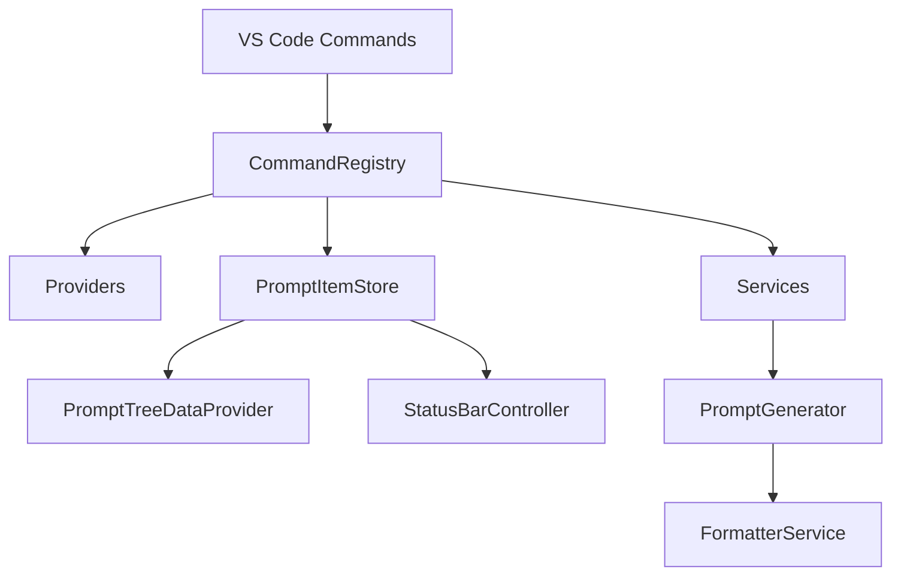
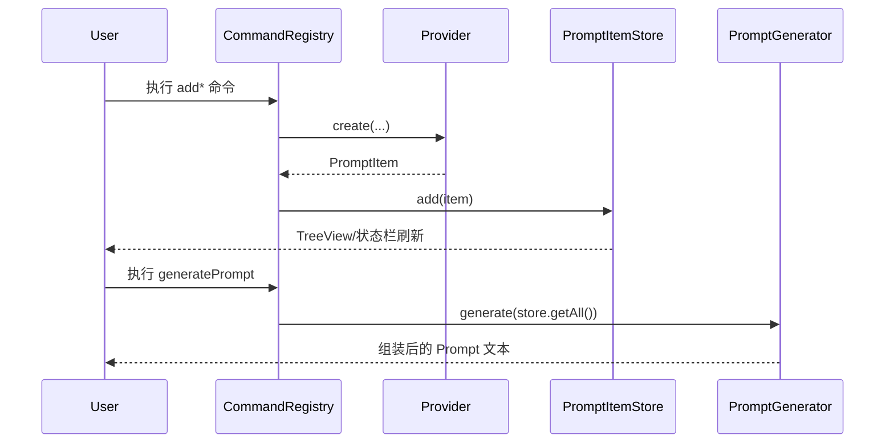

# Extension Architecture

## Overview

该扩展在 VS Code 内维护一个内存态 `PromptItem` 集合，并通过命令将多源内容（文件、片段、终端、目录树、Git Diff、用户指令）汇聚为统一 Prompt 文本。

核心原则：
- 入口组装依赖，业务模块解耦。
- `PromptItemStore` 作为单一状态源。
- 通过 `IContentProvider` 抽象扩展内容类型，避免命令层膨胀。

## Architecture

## Components

- `src/extension.ts`
  - 创建 `PromptItemStore`、TreeView、状态栏控制器。
  - 组装 `CommandRegistry` 并注册可释放资源。

- `src/commands/CommandRegistry.ts`
  - 注册全部 `assemble-code-to-prompt.*` 命令。
  - 负责命令路由、参数解析、错误提示与配置重载入口。

- `src/core/PromptItemStore.ts`
  - 提供 `add/remove/update/reorder/clear`。
  - 维护索引并通过事件通知 UI 层刷新。

- `src/providers/*.ts`
  - 统一实现 `IContentProvider` 或 `IEditableContentProvider`。
  - 每个 provider 只负责一种数据来源的采集与去重逻辑。

- `src/services/*.ts`
  - `PromptGenerator`：按固定顺序生成输出。
  - `FormatterService`：封装 xml/markdown/plain/github/custom 格式化。
  - `IgnoreService`：处理目录扫描忽略规则。
  - `PathService`/`ExportService`：路径转换、导出能力。

- `src/ui/*.ts`
  - `PromptTreeDataProvider`：TreeView 数据源与拖拽排序。
  - `StatusBarController`：状态栏数量/状态展示。
  - `MultilineInputDialog`：多行输入交互。

- `src/types/index.ts`
  - `PromptItem` 联合类型与 `PromptItemType`、`ContentMode`、排序/事件类型定义。

## PromptItem Lifecycle

## Generation Order Contract

`PromptGenerator` 必须按以下顺序生成（保持与用户认知一致）：
1. 用户指令
2. 终端输出
3. 文件夹结构
4. Git Diff
5. 代码文件与代码片段

## Extension Points

- 新增内容类型时：
  1. 在 `src/types/index.ts` 扩展类型。
  2. 新增 provider 实现 `IContentProvider`。
  3. 在 `CommandRegistry` 中注入 provider 并注册命令。
  4. 在 `PromptTreeDataProvider` 与 `PromptGenerator` 补齐显示/格式化逻辑。

- 新增输出格式时：
  - 在 `FormatterService` 增加预设分支，并通过设置项暴露。

## Testing Requirements

- 至少覆盖：
  - `PromptGenerator` 顺序与排序输出。
  - `IgnoreService` 的目录/扩展名/glob 匹配行为。
  - `PromptItemStore` 事件触发与 reindex 正确性。
