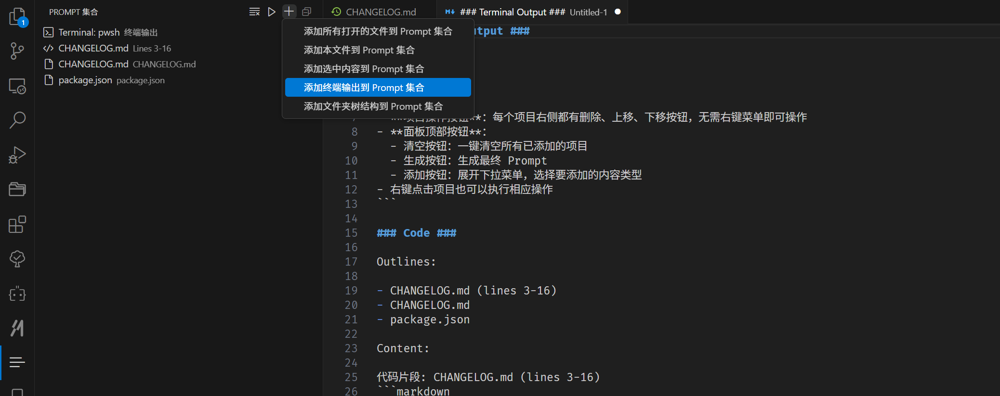

# Code to Prompt

VS Code 扩展，用于将代码、终端输出和文件夹结构快速合并为格式化的 Prompt，方便复制到 GPT 等 AI 工具中。

## 主要功能

- **构建 Prompt 内容**：逐步添加内容到集合，然后生成 Prompt
- **支持多种内容类型**：
  - 代码文件
  - 代码片段
  - 终端输出
  - 文件夹树结构



## 使用方法


1. 添加内容到 Prompt 集合：
   - Ctrl+Shift+P 打开命令面板，输入并选择 "Prompt: " 开头的命令
   - 或者点击面板顶部的添加按钮，选择要添加的内容类型
2. 在左侧活动栏的 "Prompt 集合" 面板中查看已添加的项目
3. 点击面板顶部的 "生成 Prompt" 按钮生成最终 Prompt

## 快捷操作

- **项目操作按钮**：每个项目右侧都有删除、上移、下移按钮，无需右键菜单即可操作
- **面板顶部按钮**：
  - 清空按钮：一键清空所有已添加的项目
  - 生成按钮：生成最终 Prompt
  - 添加按钮：展开下拉菜单，选择要添加的内容类型
- 右键点击项目也可以执行相应操作

## Prompt 格式

生成的 Prompt 将按以下顺序组织内容：

1. **终端输出**（如果有）
2. **文件夹树结构**（如果有）
3. **代码文件和代码片段**

## 示例输出

> ### Terminal Output ###
>
> Terminal: PowerShell
> ```
> PS> node -v
> v20.11.1
> ```
>
> ### Folder Structure ###
>
> Tree: src
> ```
> src/
> ├── extension.ts
> ├── promptManager.ts
> ├── promptTreeProvider.ts
> ├── commandHandler.ts
> └── statusBarController.ts
> ```
>
> ### Code ###
>
> Outlines:
>
> - package.json (snippet)
> - tsconfig.json
>
> Content:
>
> 文件: package.json (lines 1-20)
> ```json
>   "name": "assemble-code-to-prompt",
>   "displayName": "Code to Prompt",
>   "author": {
>     "name": "frostime"
>   },
>   "description": "快速将代码、终端输出和文件夹结构合并成一个 Prompt，方便你复制给 GPT",
>   "repository": {
>     "type": "git",
>     "url": "https://github.com/frostime/vscode-files2prompt"
>   },
>   "version": "1.1.1",
>   "engines": {
>     "vscode": "^1.95.0"
>   },
>   "categories": [
>     "Other"
>   ],
> ```
>
> 文件: tsconfig.json
> ```json
> {
>   "compilerOptions": {
>     "module": "Node16",
>     "target": "ES2022",
>     "outDir": "out",
>     "lib": [
>       "ES2022"
>     ],
>     "sourceMap": true,
>     "rootDir": "src",
>     "strict": true
>   }
> }
> ```


## 关于

- 作者：frostime
- 仓库：[GitHub](https://github.com/frostime/vscode-files2prompt)
- 问题反馈：请在 GitHub 仓库提交 Issue